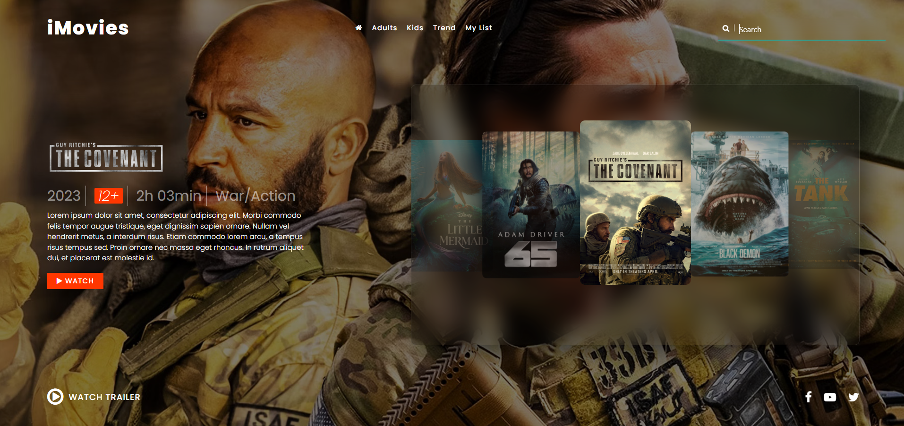

# iMovie# 🎬 iMovies – Movie Landing Page

**iMovies** is a sleek and responsive movie landing page built with a cinematic UI in mind. Designed as a sample project, it showcases a featured film with beautiful visuals, essential movie info, and a call to action to watch the trailer.

---

## 📖 About

This project simulates a modern movie website homepage.  
It features a bold hero banner for a highlighted movie, genre and rating info, interactive trailer viewing, and a horizontally scrolling slider of trending films.

The page is ideal as a **UI/UX design showcase** or as the front-end template for a streaming or movie review platform.

---

## ✨ Features

- 🎥 Full-width hero banner with dynamic movie background
- 🏷️ Genre, rating, runtime, and release year badges
- 📜 Movie description area
- ▶️ Watch Trailer button with modal or video link (depending on setup)
- 🎞️ Carousel of other featured or trending movies
- 🌐 Clean top navigation bar
- 📱 Fully responsive layout
- 🔍 Search bar design
- 🎨 Polished design using HTML, CSS & JavaScript (or your framework if used)

---

## 📸 Preview

> You can upload this screenshot to `/screenshots/preview.png`

---

## 🚀 Technologies Used

- **HTML5**
- **CSS3** (Flexbox/Grid, modern styles)
- **JavaScript** 
- **Font Awesome** (for icons)

---

## 🌐 Live Demo

Check out the live version:  
👉 ([jasonfuentess.github.io/iMovie](https://jasonfuentess.github.io/iMovie/))

---

